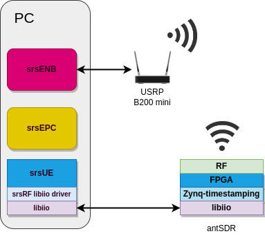

.. Application Note: End-to-End 4G testing with AntSDR

.. _antsdr:

Application Note: End-to-End 4G testing with AntSDR
===================================================

Overview
********

Hardware and Software Requirements
**********************************

For this application note, the following hardware and software will be used:

        1. Dell XPS13 with Ubuntu 20.04.4
        2. USRP B200 mini
        3. antsdr with custom SRS bitstream
        4. srsRAN
        5. SRS Zynq timestamping
        6. Analog Devices libiio and libad9361 software libraries

Prerequisites
*************

1. You need to generate the custom SRS timestamp bitstream and to load it in the board (see the
:ref:`antsdr_project`
section for more details).

2. Install srsRAN dependencies:

.. code-block:: bash

    sudo apt-get install build-essential cmake libfftw3-dev libmbedtls-dev libboost-program-options-dev libconfig++-dev libsctp-dev

3. Install the libiio software library (see Analog Devices
`libiio wiki <https://wiki.analog.com/resources/tools-software/linux-software/libiio>`_
and
`libad9361-iio repository <https://github.com/analogdevicesinc/libad9361-iio>`_
for the full instructions).

Building and configuring srsRAN
*******************************

1. Set the board IP, the frequency offset and the RX gain for the UE:

.. code-block:: bash

    export BOARD_IP="192.168.1.10"
    export FREQ_OFFSET="-4100"
    export RX_GAIN=50

2. Execute the initialization script. It will compile the srsRAN stack as well as the RF drivers
utilized by the Zynq timestamping solution. Moreover, it will also modify the default srsenb and
srsue configuration with the parameter values defined above.

.. code-block:: bash

    git clone https://github.com/srsran/zynq_timestamping.git --recursive
    cd app
    ./prepare.sh

srsENB
------

Check the following parameters in bin_app/srsue/enb.conf.

In enb.conf:

.. code-block::

    [enb]
    n_prb = 6
    [rf]
    rx_gain = 80
    [expert]
    max_prach_offset_us = 1000
    lte_sample_rates = true

In sib.conf:

.. code-block::

    prach_freq_offset = 0
    zero_correlation_zone_config = 0

srsUE
-----

The following parameters have been configured with `prepare.sh` script: freq_offset, rx_gain,
time_adv_nsamples, continuous_tx, ndevice_args, nof_phy_threads and lte_sample_rates.

Running
*******

Network Namespace Creation
--------------------------

Let's start with creating a new network namespace called "ue1" for the (first) UE:

.. code::

  sudo ip netns add ue1

To verify the new "ue1" netns exists, run:

.. code::

  sudo ip netns list

Running the EPC
---------------

Now let's start the EPC. This will create a TUN device in the default network namespace and
therefore needs root permissions.

.. code::

  cd ./bin_app/srsepc; sudo ./srsepc ./epc.conf

Running the eNodeB
------------------

Let's now launch the eNodeB. In our test setup, the eNodeB uses an USRP B200 mini wit serial number
`318A396` (replace the serial as required by your setup):
.. code::

  cd ./bin_app/srsenb; sudo nice -20 ./srsenb ./enb.conf --rf.device_name=uhd --rf.device_args=serial=318A396

Running the UE
--------------

Lastly we can launch the UE, again with root permissions to create the TUN device.

.. code::

  sudo LD_LIBRARY_PATH=./bin_app nice -20 ./bin_app/srsue/srsue ./bin_app/srsue/ue.conf --gw.netns=ue1

The last command should start the UE and attach it to the core network.
The UE will be assigned an IP address in the configured range (e.g. 172.16.0.2).

Traffic Generation
------------------

To exchange traffic in the downlink direction, i.e. from the the EPC, just run ping or iperf as
usual on the command line, e.g.:

.. code::

  ping 172.16.0.2

In order to generate traffic in the uplink direction it is important to run the ping command
in the UE's network namespace.

.. code::

  sudo ip netns exec ue1 ping 172.16.0.1

Namespace Deletion
------------------

After finishing, make sure to remove the netns again.

.. code::

  sudo ip netns delete ue1

Troubleshooting
***************

- Make sure antsdr IP is correctly configured in ue.conf, for example:

.. code-block::

    [rf]
    device_name = iio
    device_args = n_prb=6,context=ip:10.12.1.201

Limitations
***********

- Number of PRB is limited to 6.
