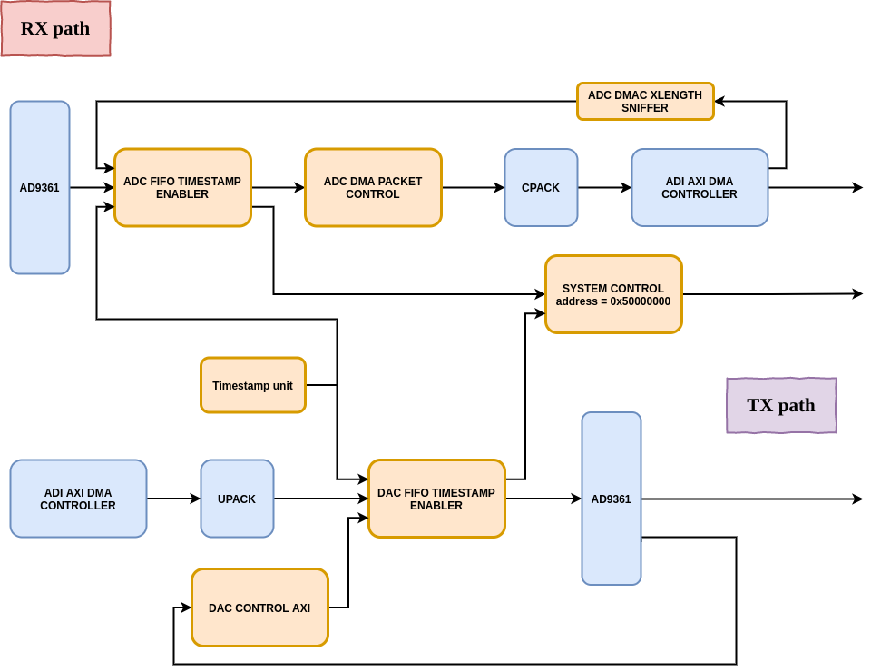

# System diagram




# Bitstream generation

- (optional) **Only** if you have installed the SRS Python package:

```
export ENABLE_SRS_SCRIPTS=1
```

- Clone ADI HDL repository:

```{bash}
./prepare.sh
```

- Set Vivado enviroment:

```{bash}
source /opt/Xilinx/Vivado/2019.2/.settings64-Vivado.sh
```

- Generate SRS IPs, ADI IPs and bitstream:

```{bash}
make bitstream
```

# Bootgen

- Generate the boot file:

```{bash}
make gen-boot
```

- Configure the antsdr parameters:

```
export ANT_USER="root"
export ANT_PASS="analog"
export ANT_IP="10.12.1.201"
```

- Load boot files to antsdr:
```
make load-boot 
```

Reboot the board.


# Others

- Configure antsdr IP:

```
sudo screen /dev/ttyUSB8 115200
ifconfig eth0 10.12.1.201
```

- Load boot files to antsdr manually:

```
export ANT_USER="root"
export ANT_PASS="analog"
export ANT_IP="10.12.1.201"

sshpass -p $ANT_PASS ssh -o StrictHostKeyChecking=no $ANT_USER@$ANT_IP "mkdir /mnt/data"
sshpass -p $ANT_PASS ssh -o StrictHostKeyChecking=no $ANT_USER@$ANT_IP "mount /dev/mmcblk0p1 /mnt/data"
sshpass -p $ANT_PASS scp ./bootgen/BOOT.bin $ANT_USER@$ANT_IP:/mnt/data/BOOT.bin
sshpass -p $ANT_PASS ssh -o StrictHostKeyChecking=no $ANT_USER@$ANT_IP "sync"
sshpass -p $ANT_PASS ssh -o StrictHostKeyChecking=no $ANT_USER@$ANT_IP "umount /mnt/data"
```