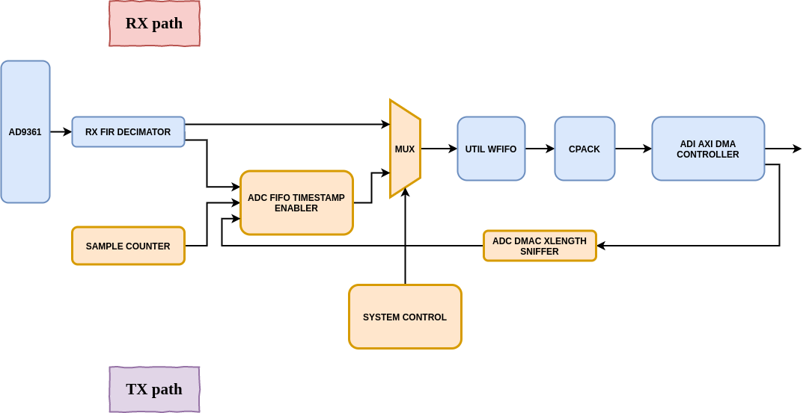

# System diagram




# Project

- Clone ADI HDL repository:

```{bash}
./prepare.sh
```

- Set Vivado enviroment:

```{bash}
source /opt/Xilinx/Vivado/2019.2/.settings64-Vivado.sh
```

- Generate SRS IPs, ADI IPs and bitstream:

```{bash}
make bitstream
```

- Generate the boot file, load it in the board and reset it:

```{bash}
make gen-boot-load
```